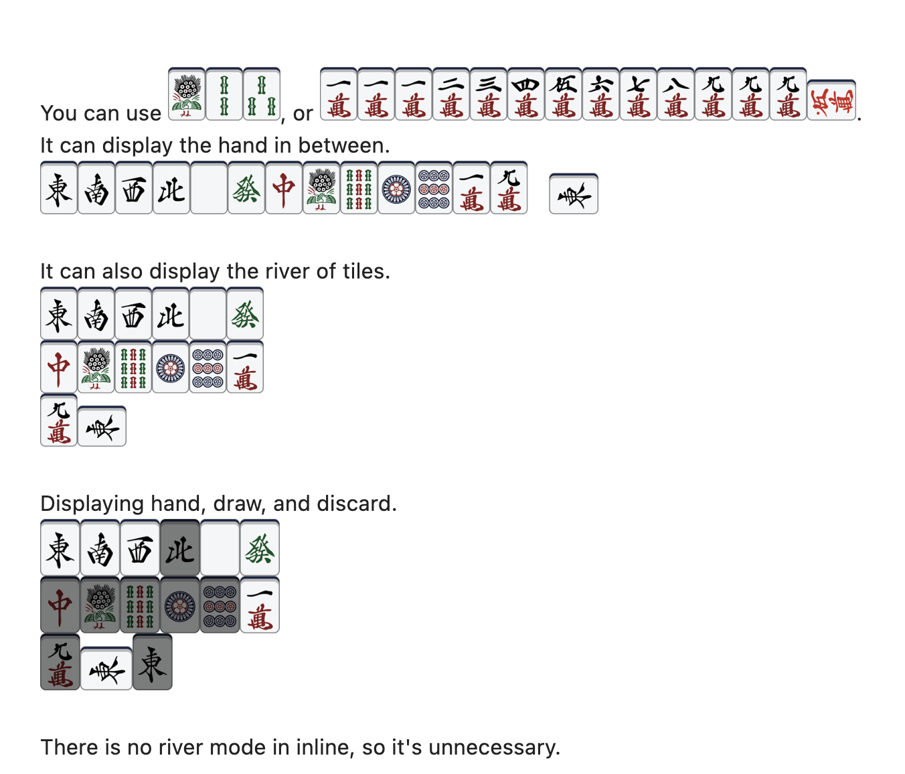
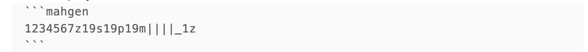
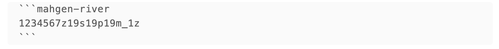
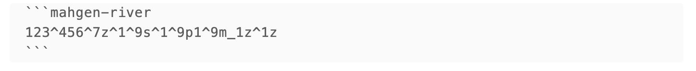

# Obsidian-mahgen-plugin

This is a plugin for [mahgen](https://github.com/eric03742/mahgen) to render in [Obsidian](https://obsidian.md/)

If you have opinions or suggestions, please open issues to let me know, or open pull requests fix it directly!

# Install

(If this plugin was accepted)
1. Open Obsidian.
2. Go to `Settings` > `Community Plugins` > `Browse`.
3. Search for **mahgen**.
4. Click `Install` and enable the plugin.

# Build

To build the plugin, use the following commands:
```bash
npm i
npm run dev
```

Make the folder `.obsidian/plugins/obsidian-mahgen-plugin`, and copy `main.js, styles.css, manifest.json` inside.
Go to Settings > Community Plugins. Enable 'Allow installing plugins from outside the Obsidian Hub.'
Enable this plugin.
# Usage



You can use `mg 1s2s3s`, or `mahgen 1112345678999m_0m`.
It can display the hand in between.



It can also display the river of tiles.




Displaying hand, draw, and discard.



There is no river mode in inline, so it's unnecessary.

More details, please refer to [mahgen](https://github.com/eric03742/mahgen).

# Known issues

<!-- 1. For some themes (like Blue Topaz) the inline tiles may render like in between. -->
1. Rendering takes some time, so sometimes you can see original inline code like `mg 1s`. Click anywhere it will rerender.